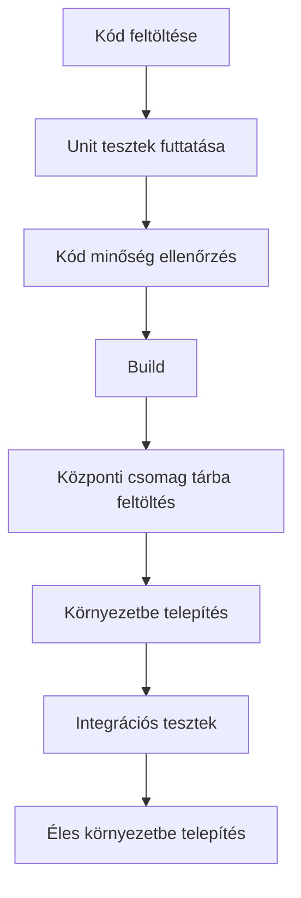

# Technikai Specifikáció - Dinamikus Űrlapkészítő Rendszer

## 1. Áttekintés
A Dinamikus Űrlapkészítő Rendszer lehetővé teszi a felhasználók számára, hogy saját űrlapokat tervezzenek és kezeljenek anélkül, hogy fejlesztői beavatkozásra lenne szükség. A rendszer a következő főbb képességekkel rendelkezik:
- Felhasználóbarát drag-and-drop űrlapszerkesztő
- Több típusú mező támogatása
- Egyéni validációk és szabályok meghatározása
- Valós idejű előnézet
- Verziókövetés és változásnapló

## 2. Architektúra

### 2.1 Magas szintű architektúra
```
┌─────────────────┐     ┌───────────────────┐     ┌───────────────────┐
│  Frontend       │     │  API Gateway      │     │  Backend Services │
│  (Angular)      │◄───►│  (Ocelot)         │◄───►│  (ASP.NET Core)   │
└─────────────────┘     └───────────────────┘     └───────────────────┘
                                 ▲
                                 │
                        ┌────────┴────────┐
                        │  Shared Services  │
                        └───────────────────┘
```

### 2.2 Részletes komponens diagram

```
┌─────────────────────────────────────────────────────────────────┐
│                      Form Builder Frontend                      │
│  ┌─────────────┐  ┌─────────────────┐  ┌───────────────────┐  │
│  │ Form Editor │  │ Field Palette   │  │ Live Preview      │  │
│  │ (drag-drop) │  │ (available      │  │ (real-time        │  │
│  └──────┬──────┘  │  form fields)   │  │  preview)         │  │
│         │         └─────────────────┘  └───────────────────┘  │
│         │                                                     │
│  ┌──────▼──────┐  ┌─────────────────┐  ┌───────────────────┐  │
│  │ Field       │  │ Validation      │  │ Layout Tools      │  │
│  │ Properties  │  │ Rules Editor    │  │ (grid, tabs, etc) │  │
│  └─────────────┘  └─────────────────┘  └───────────────────┘  │
└───────────────────────────────┬───────────────────────────────┘
                                │
                                ▼
┌─────────────────────────────────────────────────────────────────┐
│                      Form Builder API                           │
│  ┌─────────────────┐  ┌─────────────────┐  ┌─────────────────┐ │
│  │ Form Definition │  │ Form Rendering  │  │ Form Submission │ │
│  │ Management      │  │ Engine          │  │ Handler         │ │
│  └────────┬────────┘  └────────┬────────┘  └────────┬────────┘ │
│           │                    │                    │          │
└───────────┼────────────────────┼────────────────────┼──────────┘
            │                    │                    │
            ▼                    ▼                    ▼
┌───────────────────────┐  ┌───────────────┐  ┌───────────────┐
│  Form Definitions DB  │  │  Form Data DB │  │  Audit Logs   │
│  (MongoDB)           │  │  (MSSQL)      │  │  (Elastic)    │
└───────────────────────┘  └───────────────┘  └───────────────┘
```

## 3. Adatmodell

### 3.1 Fő entitások

#### FormDefinition
```typescript
interface FormDefinition {
  id: string;                     // Egyedi azonosító
  name: string;                   // Űrlap neve
  description?: string;           // Opcionális leírás
  version: number;               // Verziószám
  status: 'draft' | 'published' | 'archived';
  fields: FormField[];           // Mezők listája
  layout: LayoutConfig;          // Elrendezés konfigurációja
  validationRules: ValidationRule[]; // Globális validációs szabályok
  createdAt: Date;
  updatedAt: Date;
  createdBy: string;             // Létrehozó felhasználó
  updatedBy: string;             // Utolsó módosító
  tenantId: string;              // Bérlő azonosító
}
```

#### FormField
```typescript
interface FormField {
  id: string;                   // Egyedi azonosító
  name: string;                 // Technikai név (pl. "firstName")
  label: string;                // Felhasználóbarát megjelenítendő név
  type: FieldType;              // Mező típusa
  required: boolean;            // Kötelező mező
  defaultValue?: any;           // Alapértelmezett érték
  placeholder?: string;         // Súgószöveg
  options?: SelectOption[];     // Opciók (select, radio, checkbox esetén)
  validation?: FieldValidation; // Mezőszintű validációk
  visibility?: VisibilityRule[]; // Láthatósági szabályok
  order: number;                // Sorrend az űrlapon
  groupId?: string;             // Csoportosításhoz
  metadata?: Record<string, any>; // Egyéni metaadatok
}

enum FieldType {
  Text = 'text',
  Number = 'number',
  Email = 'email',
  Date = 'date',
  Select = 'select',
  Checkbox = 'checkbox',
  Radio = 'radio',
  Textarea = 'textarea',
  File = 'file',
  // Egyéb mezőtípusok...
}
```

## 4. API Specifikáció

### 4.1 Végpontok

#### Űrlapdefiníciók kezelése
```
GET    /api/forms                   - Összes űrlap listázása
POST   /api/forms                   - Új űrlap létrehozása
GET    /api/forms/{id}              - Űrlap részletei
PUT    /api/forms/{id}              - Űrlap frissítése
DELETE /api/forms/{id}              - Űrlap törlése
POST   /api/forms/{id}/publish      - Űrlap közzététele
POST   /api/forms/{id}/duplicate    - Űrlap másolása
```

#### Mezők kezelése
```
POST   /api/forms/{formId}/fields    - Új mező hozzáadása
PUT    /api/fields/{fieldId}        - Mező frissítése
DELETE /api/fields/{fieldId}        - Mező törlése
```

#### Űrlap kitöltések
```
POST   /api/forms/{formId}/submissions - Új kitöltés
GET    /api/forms/{formId}/submissions - Kitöltések listázása
GET    /api/submissions/{id}         - Kitöltés részletei
```

## 5. Frontend implementáció

### 5.1 Fő komponensek

#### FormEditorComponent
- Felelős az űrlap szerkesztő felület megjelenítéséért
- Drag-and-drop funkcionalitás a mezők hozzáadásához és átrendezéséhez
- Valós idejű előnézet

#### FieldPropertiesPanel
- A kiválasztott mező tulajdonságainak szerkesztése
- Validációs szabályok konfigurálása
- Megjelenítési beállítások

#### FormPreviewComponent
- Az űrlap valós idejű előnézete
- Tesztelési lehetőség a szerkesztés közben

## 6. Biztonság

### 6.1 Hitelesítés és engedélyezés
- JWT alapú hitelesítés
- Szerepkör alapú hozzáférés-vezérlés (RBAC)
  - `form.admin` - Teljes hozzáférés
  - `form.editor` - Szerkesztési jogosultság
  - `form.viewer` - Csak megtekintés

### 6.2 Adatvédelem
- Minden űrlap definíció és kitöltés bérlői szinten elkülönítve
- Bizalmas adatok titkosítva tárolva
- Naplózott minden változtatás (ki, mikor, mit módosított)

## 7. Teljesítményoptimalizálás

### 7.1 Gyorsítótárazás
- Űrlap definíciók gyorsítótárazása Redis-ben
- Előre lefordított validációs szabályok
- Lazy loading a nagy űrlapokhoz

### 7.2 Optimalizált adatbázis műveletek
- Indexelés a gyakori lekérdezésekhez
- Particionálás nagy mennyiségű űrlapadathoz
- Batch feldolgozás tömeges műveletekhez

## 8. Telepítés és üzemeltetés

### 8.1 Követelmények
- .NET 8.0+
- Angular 16+
- MongoDB 6.0+ (űrlapdefiníciókhoz)
- MS SQL Server 2022+ (űrlapadatokhoz)
- Redis 7.0+ (gyorsítótárazáshoz)

### 8.2 CI/CD folyamat


## 9. Tesztelési stratégia

### 9.1 Egységtesztek
- Minden egyes mezőtípus működésének ellenőrzése
- Validációs szabályok tesztelése
- Adatbázis műveletek mockolása

### 9.2 Integrációs tesztek
- API végpontok tesztelése
- Adatbázis integráció
- Külső szolgáltatások mockolása

### 9.3 Teljesítménytesztek
- Párhuzamos felhasználói terhelés szimulálása
- Válaszidők mérése
- Memóriahasználat monitorozása

## 10. Dokumentáció

### 10.1 Felhasználói dokumentáció
- Útmutató az űrlapszerkesztő használatához
- Gyakori feladatok lépésről lépésre
- Gyakori problémák és megoldások

### 10.2 Fejlesztői dokumentáció
- API dokumentáció (Swagger/OpenAPI)
- Adatbázis séma dokumentáció
- Telepítési és fejlesztői útmutató

## 11. Kockázatok és enyhítések

| Kockázat | Lehetséges hatás | Megelőzés/Enyhítés |
|----------|------------------|--------------------|
| Teljesítményproblémák nagy űrlapoknál | Lassú betöltési idők | Lazy loading, pagináció, optimalizált lekérdezések |
| Adatvesztés szerkesztés közben | Hiányzó vagy sérült adatok | Automatikus mentés, változásnapló, visszaállítási pontok |
| Biztonsági rések | Adatszivárgás, jogosulatlan hozzáférés | Szigorú hitelesítés, adattitkosítás, sebezhetőségi vizsgálatok |
| Bérlői adatok keveredése | Adatsérülés, jogszabályi követelmények sérülése | Több-bérlős architektúra, szigorú adatelkülönítés |

## 12. Következő lépések

1. Részletes tervek kidolgozása az egyes komponensekhez
2. Prototípus készítése a felhasználói felületről
3. Adatbázis sémák finomhangolása
4. Biztonsági felmérés elvégzése
5. Korai tesztelés korlátozott felhasználói körrel
